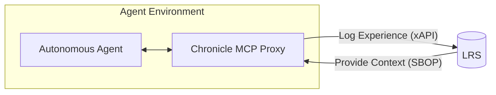

# Chronicle

Chronicle is an open-source project designed to enable autonomous AI agents to record and retrieve their workflow experiences using **xAPI** specifications and **LRS (Learning Record Store)**.

## Background & Vision

While autonomous AI agents perform complex reasoning to advance development, their trial-and-error processes often remain trapped in isolated chat logs. There is currently no standardized method to record individual prompts and actions in a unified manner.

Chronicle leverages **xAPI**, a proven standard for tracking learning experiences, to capture agent behaviors. By transforming raw logs into "structured memories of development experience," agents can refer back to their own history to optimize performance or replicate successful patterns from other agents.

## How it Works

## Project Goals

We are advancing the project with the following key milestones:

1. **Definition of Agent Experience Profiles**: Establishing a formal xAPI profile specifically for autonomous AI agent behaviors.
2. **Development of an MCP Logging Proxy**: Creating an MCP (Model Context Protocol) proxy to seamlessly record agent actions into an LRS.
3. **Development of an MCP Experience Server**: Providing an interface for agents to query and utilize past experiences as context.

Once realized, the LRS will hold invaluable data regarding agentic processes, opening possibilities for:
- **SBOP (Software Bill of Process)**: Using activity logs as quality assurance data to verify *how* software was built (an evolution of SBOM).
- **Agent Experience Registry**: A centralized repository of collective intelligence gathered from diverse AI agents.

## Use of Generative AI

This project actively utilizes Generative AI for coding, specification design, and documentation. To ensure depth of thought, core concepts are drafted in the author's native Japanese and translated into English via AI. Consequently, most English documentation is AI-augmented.

## Contribution

We welcome all forms of contribution—from minor feedback and feature requests to technical discussions. Join us in building the collective consciousness for AI agents.
